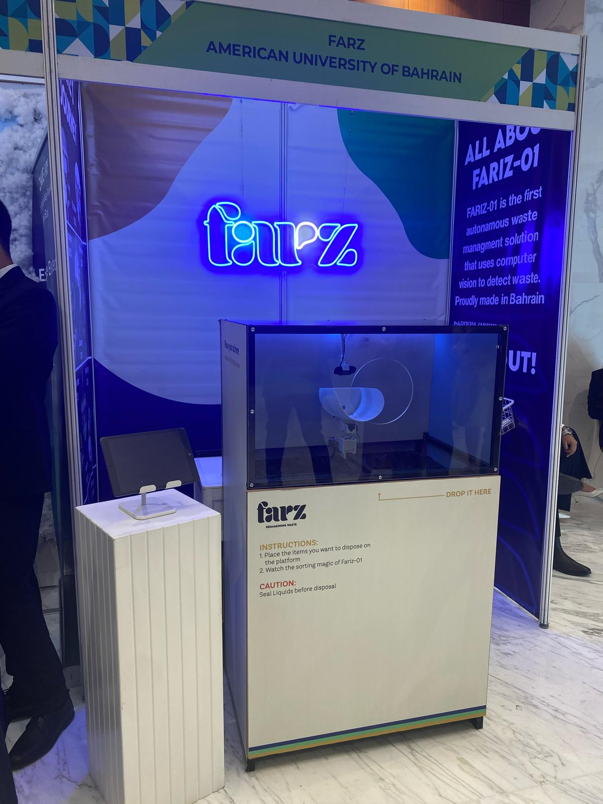

# TFOD_Farz

# Farz: AI Waste Management Solution

**Farz** is an AI waste management company and the winner of Product of the Year at Injaz Bahrain Company Program 2024. Our flagship product, **Fariz-01**, is an AI-powered recycling bin that uses computer vision to identify and sort different types of waste at the point of disposal.



---

## About Fariz-01

Fariz-01 is an autonomous waste management solution designed and built in Bahrain. It leverages deep learning models to classify waste items and sort them automatically, making recycling easier and more efficient.

- **AI-powered**: Uses computer vision to detect and classify waste.
- **Edge deployment**: Runs on a Raspberry Pi for real-time, on-device inference.
- **Award-winning**: Product of the Year, Injaz Bahrain 2024.

For hardware and electronics details, see the [Farz Electronics Repo](https://github.com/imrun10/farz).

---

## Dataset

The model is trained on a curated and cleaned dataset of waste images.  
- **Dataset:** [Garbage Classification 3 (Roboflow)](https://universe.roboflow.com/material-identification/garbage-classification-3/dataset/2)

---

## Waste Categories

The model classifies waste into the following categories:
- **0:** BIODEGRADABLE
- **1:** CARDBOARD
- **2:** GLASS
- **3:** METAL
- **4:** PAPER
- **5:** PLASTIC

---

## Getting Started

### Prerequisites

Install the following Python dependencies:

```python
import numpy as np
from PIL import Image
import tensorflow as tf
import time
import cv2
import ultralytics
```

You can install them using pip:

```sh
pip install numpy pillow tensorflow opencv-python ultralytics
```

### Running the Model

The scripts in this repository are designed for use on a Raspberry Pi or any Linux-based system with a camera.

- **YOLOv8 Inference:**  
  Use scriptYOLO.py or script2.py to run real-time object detection using the YOLOv8 model.

- **TensorFlow Lite Inference:**  
  Use scripTFLITE.py for lightweight inference with a TFLite model.

---

## Training

Model training is performed using Google Colab and the [Ultralytics YOLO](https://docs.ultralytics.com/) library.  
Refer to the Jupyter notebook Garbage_Classification_Yolov8.ipynb for the full training pipeline.

---

## Electronics & Integration

For hardware integration, Raspberry Pi setup, and bin actuation, refer to the [Farz Electronics Repo](https://github.com/imrun10/farz).

---

## Contributing

Pull requests are welcome. For major changes, please open an issue first to discuss what you would like to change.

---

## License

This project is for educational and demonstration purposes.

---

## Acknowledgements

- **Injaz Bahrain Company Program 2024**
- **American University of Bahrain**
- **Roboflow** for dataset hosting

---

For questions or support, please open an issue or contact the Farz team.
